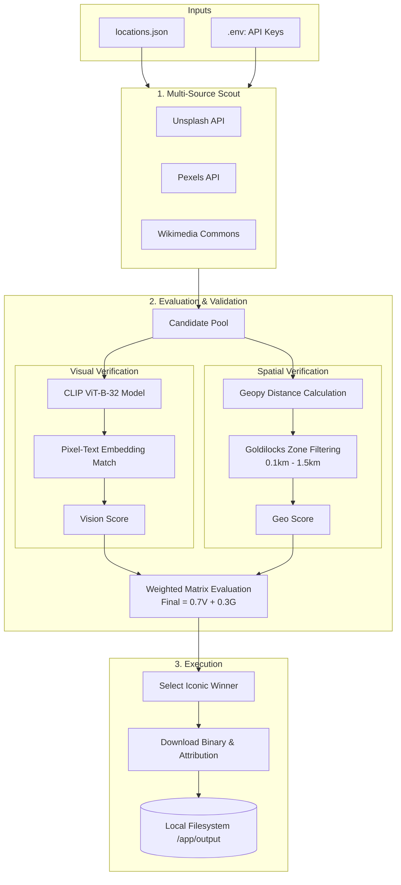

An image generation and retrieval agent for NYC points of interest.

This document serves as a window to my thought process while developing the application. In the following paragraphs, I will do my best to justify my design choices and explain my code.

Objective: to build a local autonomous agent that given a new your city location and coordinates, will automatically discover, evaluate, score and download representative images with proper licensing and attribution.

The deliverables can be found [here](https://github.com/haru-02/NYCview)

## The process and architecture:

- The development process can be quantified by the following steps, and will follow a similar pattern to the previous assessment.
  - docker environment setup
  - Sourcing (from different sources and apis)
    - Evaluation - both geographically and visually
    - Calculating final score by weighing them appropriately.
  - scoring the results for each picture and choosing the result with the best score.
  - downloading the best result and adding the metadata as per the format requirement.

The functional architecture is pretty simple, and it can be visualised as follows:

This is the entire flow of agent.py aptly explains how it works. It takes the env key, makes a request that will fetch candidates (pictures) from different sources and then score them against a metric. The higher the score, the more relevant it is. Since Unsplash and pexel has a lot of images that are quite artistic, i gave them an added weight of 0.08.

## Conclusion:

The resulting project is a lot more robust and can make a better judgement of the pictures for the places provided and provide the appropriate metadata. since all images are attributed properly, there won't be any licensing issues.
