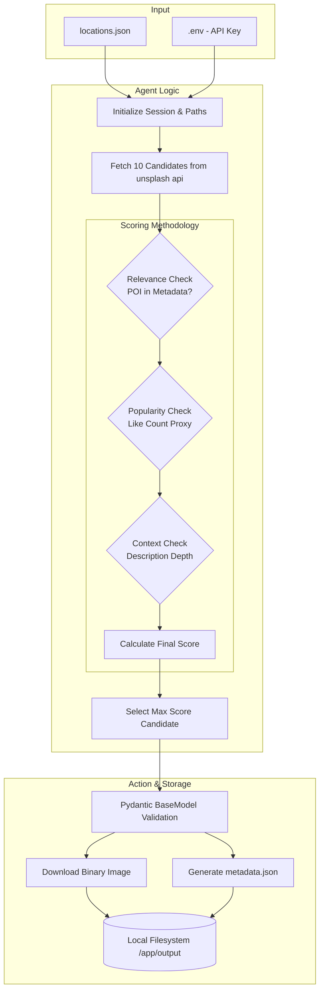

An image generation and retrieval agent for NYC points of interest.

This document serves as a window to my thought process while developing the application. In the following paragraphs, I will do my best to justify my design choices and explain my code.

Objective: to build a local autonomous agent that given a new your city location and coordinates, will automatically discover, evaluate, score and download representative images with proper licensing and attribution.

The deliverables can be found [here](https://github.com/haru-02/NYCview)
## The process and architecture:

- The development process can be quantified by the following steps, and will follow a similar pattern to the previous assessment.
	- docker environment setup
	- unsplash api credentials genration
	- locations.json - deciding the location.
	- accessing the api and fetching results.
	- scoring the results for each location and choosing the result with the best score.
	- downloading the best result and adding the metadata as per the format.

The functional architecture is pretty simple, and it can be visualised as follows:

This is the entire flow of agent.py aptly explains how it works. It takes the env key, makes a request that will fetch 10 candidates (pictures) and then score them against a metric. The higher the score, the more relevant it is. Since Unsplash has a lot of images that are quite artistic, it will not struggle to produce relevant outputs. wikimedia was my first choice of api in this process, but there was a lot of noise in terms of landmark ans scoring system, so i settled with the unsplash api to provide a better experience.

## Conclusion:

The resulting project is a lot more robust and can make a better judgement of the pictures for the places provided and provide the appropriate metadata. since all images are from unsplash, there won't be any licensing issues, however, credits should be given in good faith.